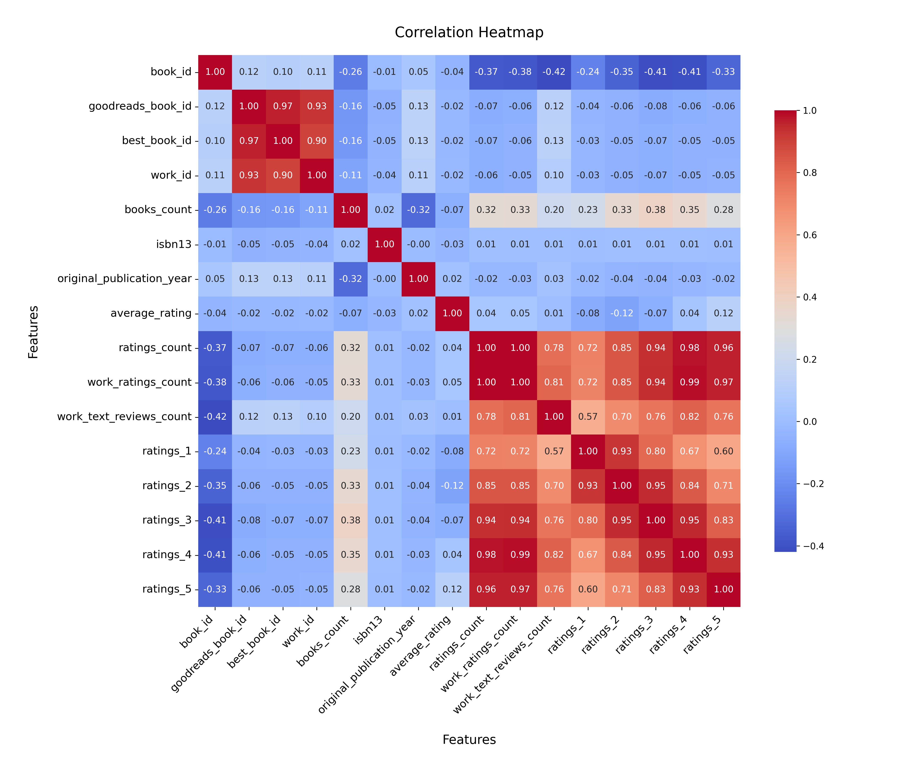

# Analysis Report

### Summary of the Goodreads Dataset

The dataset consists of 10,000 entries and 23 columns detailing various aspects of books listed on Goodreads. Key columns include book identifiers, author information, publication years, ratings, and counts of reviews. 

#### Key Insights

1. **Missing Values**: 
   - The dataset has missing values primarily in the `isbn`, `isbn13`, `original_publication_year`, `original_title`, and `language_code` columns. The `isbn` column has 700 missing entries, while `isbn13` has 585. This could impact any analysis related to book identification or publication specifics.
   - The `language_code` column has 1,084 missing values, which limits understanding of the language diversity of the books.

2. **Authors**: 
   - There are 4,664 unique authors, with Stephen King being the most prolific, having 60 entries in the dataset. This suggests that a significant number of books may be authored by a limited pool of writers.

3. **Publication Years**:
   - The average original publication year is approximately 1982, with a range from as early as -1750 to 2017. The data indicates a historical breadth, but the majority of the books are likely from the late 20th to early 21st centuries.

4. **Ratings Overview**:
   - The average rating across all books is approximately 4.00, indicating that the majority of books in this dataset are well-received.
   - The distribution of ratings is heavily skewed towards higher ratings, with the maximum ratings count reaching over 4.7 million for some books, suggesting a few highly popular titles significantly influence this average.

5. **Ratings Count**:
   - On average, books have around 54,000 ratings, with a significant standard deviation indicating a wide variation among book popularity. Some books have ratings counts that exceed 4 million, while others are considerably lower.

6. **Visual Representation**:
   - A histogram of `average_rating` can illustrate the distribution of ratings, highlighting the prevalence of highly-rated books. Similarly, a bar chart showing the number of books by `authors` can visualize authors' contributions in the dataset.

### Recommendations

1. **Data Cleaning**: 
   - Address the missing values in the `isbn`, `isbn13`, `original_publication_year`, and `language_code` columns. Consider imputing these values where possible or removing entries with too many missing fields to ensure analysis accuracy.

2. **Focus on Popular Authors**: 
   - Given the prominence of certain authors (like Stephen King), further analysis could focus on their works to understand trends, ratings, and reader engagement. This could also extend to exploring other successful authors.

3. **Publication Trends**: 
   - Analyze trends in publication years to identify patterns, such as whether newer books receive higher ratings compared to older publications. This could provide insights into changing reader preferences over time.

4. **Diversity of Languages**: 
   - With a significant number of missing `language_code` values, it would be beneficial to analyze the language distribution of the books that do have this data. This could inform future book selections and promotions.

5. **Engagement Strategies**: 
   - For books with high ratings but low ratings count, consider strategies to increase visibility and encourage more readers to engage with these titles, potentially through targeted marketing efforts.

By addressing these recommendations, further analysis can lead to deeper insights into reader preferences and trends, ultimately aiding in improving book recommendations and enhancing user experience on platforms like Goodreads.

