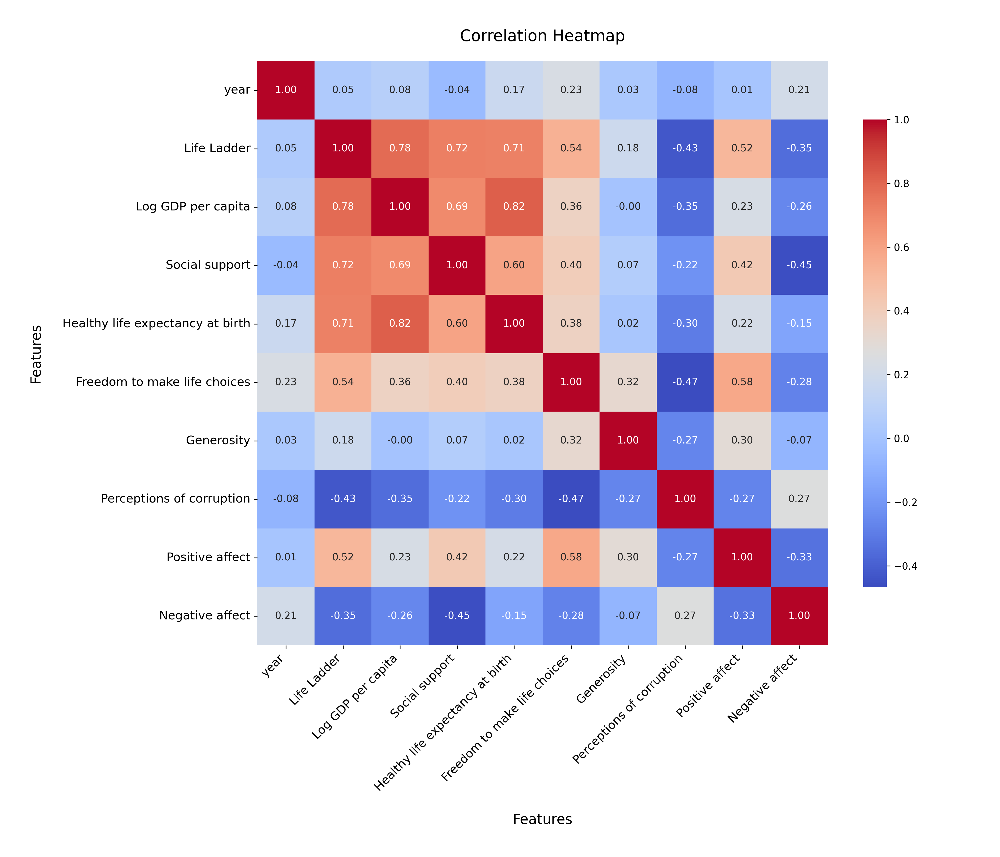
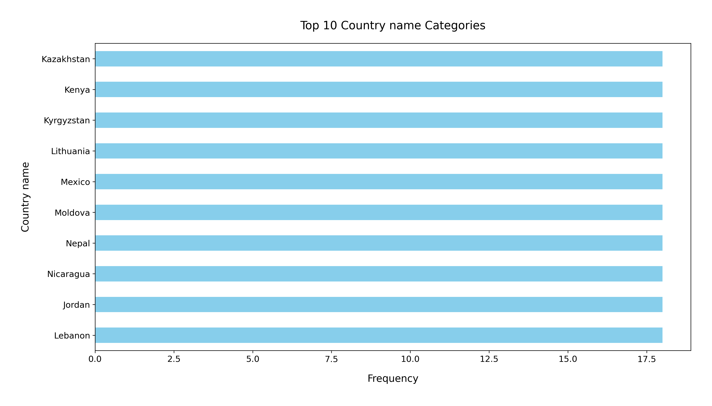

# Analysis Report

### Summary of the Happiness Dataset

The dataset `happiness.csv` comprises 2,363 rows and 11 columns, focusing on various factors contributing to happiness across different countries and years. The key columns include:

- **Country name**: The name of the country.
- **Year**: The year of the data collection.
- **Life Ladder**: A scale representing overall life satisfaction.
- **Log GDP per capita**: The logarithm of the GDP per capita, indicating economic performance.
- **Social support**: Reflects the perceived support from family and friends.
- **Healthy life expectancy at birth**: The average number of years a newborn is expected to live in good health.
- **Freedom to make life choices**: A measure of personal freedom in making choices.
- **Generosity**: Indicates willingness to donate to charity.
- **Perceptions of corruption**: Reflects views on corruption in government and business.
- **Positive affect**: Measures the positive emotions experienced.
- **Negative affect**: Measures the negative emotions experienced.

### Key Insights

1. **Missing Values**: Several columns have missing values, with the highest in 'Generosity' (81 missing) and 'Perceptions of corruption' (125 missing). This suggests that data collection may have inconsistencies, particularly regarding altruistic behaviors and views on corruption.

2. **Descriptive Statistics**:
   - The average 'Life Ladder' score is approximately **5.48**, indicating a moderate level of life satisfaction among the surveyed populations.
   - The average **Log GDP per capita** is **9.40**, suggesting a generally high economic performance.
   - **Social support** averages at **0.81**, indicating strong perceived social support among respondents.
   - **Healthy life expectancy** has a mean of **63.40 years**, which varies significantly across different countries.
   - **Freedom to make life choices** averages around **0.75**, suggesting a reasonable level of personal freedom among the surveyed populations.

3. **Correlations**: A preliminary correlation analysis might reveal strong relationships between economic factors (like Log GDP per capita) and happiness indicators (such as Life Ladder), as well as between social support and life satisfaction.

### Recommendations

1. **Addressing Missing Data**: Given the substantial missing values in critical columns such as 'Generosity' and 'Perceptions of corruption', efforts should be made to improve data collection processes. Techniques such as imputation could be employed to handle missing values better.

2. **Focus on Economic and Social Policies**: Countries with lower 'Life Ladder' scores should analyze their economic policies and social support structures. Increasing economic performance and enhancing community support networks could lead to better life satisfaction.

3. **Further Analysis**: Conduct deeper analyses to explore the relationships between different variables. For instance, employing regression models to predict 'Life Ladder' scores based on economic and social factors could provide actionable insights for policymakers.

4. **Visualizations**: Create visual representations (such as scatter plots or heatmaps) to illustrate the relationships between the different factors. This could aid in identifying trends and areas for improvement more clearly.

5. **Country-Specific Strategies**: Tailor strategies for countries based on their unique challenges and strengths as identified through the dataset. For example, nations with high GDP but low life satisfaction may need to focus more on social support and emotional well-being initiatives.

In conclusion, the dataset provides valuable insights into the factors influencing happiness across different countries. By addressing missing data and focusing on targeted economic and social policies, there is potential for significant improvements in life satisfaction globally.

