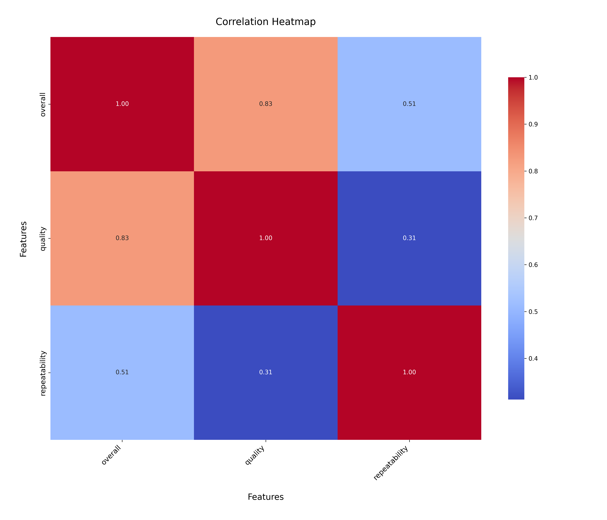
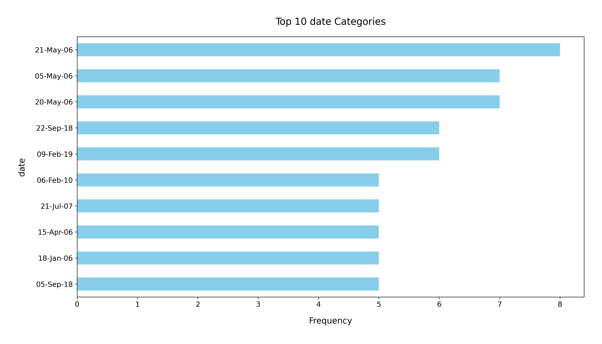

# Analysis Report

### Dataset Summary

The dataset `media.csv` contains a total of 2,652 entries across 8 columns, providing a comprehensive overview of media items with attributes such as date, language, type, title, author, and ratings. Here is a brief overview of the columns:

- **date**: The release date of the media.
- **language**: The language of the media.
- **type**: The type of media (e.g., movie, series).
- **title**: The title of the media.
- **by**: The author or creator of the media.
- **overall**: Overall rating (scale from 1 to 5).
- **quality**: Quality rating (scale from 1 to 5).
- **repeatability**: A measure of how likely the media is to be revisited (scale from 1 to 3).

### Key Insights

1. **Missing Values**: 
   - The `date` column has 99 missing values, which is significant (approximately 3.7% of the dataset).
   - The `by` column has 262 missing values, indicating that a substantial number of entries lack author information.

2. **Language Distribution**:
   - The dataset includes 11 unique languages, with English being the most represented language (1,306 occurrences).

3. **Media Type**:
   - The majority of entries are classified as "movie" (2,211 occurrences), suggesting a skew towards this type in the dataset.

4. **Title Variety**:
   - There are 2,312 unique titles, indicating a wide variety of media, although some titles are repeated (e.g., "Kanda Naal Mudhal" appears 9 times).

5. **Rating Analysis**:
   - The average overall rating is approximately 3.05, while the quality rating averages around 3.21. This suggests a generally positive perception of the media in the dataset.
   - Most entries have quality ratings concentrated around the middle of the scale, with 1 being the lowest and 5 the highest.

6. **Repeatability**:
   - The repeatability metric averages around 1.49, indicating that media items may not be highly revisited, with a majority rated at the lowest tier (1).

### Recommendations

1. **Address Missing Values**: 
   - It is essential to handle the missing values in the `date` and `by` columns. Imputation or data correction may be necessary to improve the dataset's completeness.

2. **Enhance Metadata**:
   - Adding more metadata, such as genre or target audience, could provide deeper insights and improve the analysis of media trends.

3. **Explore Language and Type Diversity**:
   - Conduct further analysis on the less represented languages and media types to identify opportunities for content expansion or targeted marketing strategies.

4. **Investigate Ratings Correlation**:
   - Investigate the correlation between overall ratings and quality ratings to determine if higher quality leads to higher overall satisfaction among viewers.

5. **Analyze Repeatability Factors**:
   - Examine factors influencing repeatability ratings. Understanding why certain media are revisited more than others could inform content creation and marketing strategies.

### Conclusion

The `media.csv` dataset provides a valuable resource for analyzing media trends, audience preferences, and potential areas for content improvement. Addressing missing data and exploring the relationships between various attributes can yield actionable insights to enhance media offerings.

